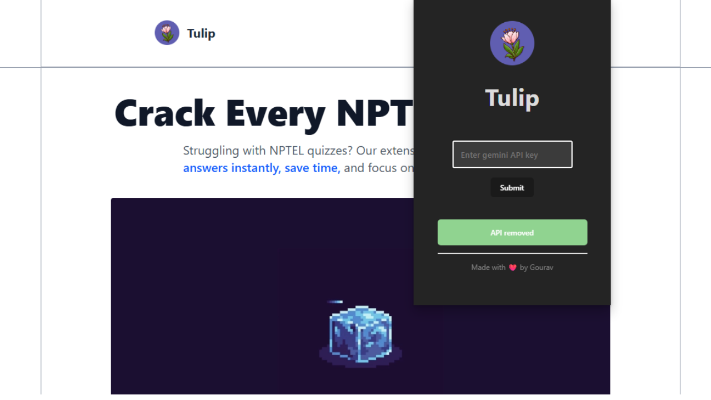

    

# 🌸 Tulip 

Tired of spending hours on NPTEL quizzes? With tulip, all it takes is a few seconds! Simply download the extension, enter your personal API key, and watch as it automatically completes your NPTEL quizzes in no time.  

---

## 🚀 About the Project  

**Tulip** started with a simple realization: *most of us don’t “solve” NPTEL assignments… we just Google every question one by one.* 😅  

That process is boring, repetitive, and wastes a lot of time you could spend learning something new—or just relaxing.  

So, **Tulip** was built to do what we all secretly wished for:  
✅ *Open your NPTEL assignment page.*  
✅ *Click one button.*  
✅ *Let Tulip complete the entire assignment for you—automatically.* 🌸  

No shady shortcuts. No stored data. Just your own Gemini API key and some smart automation.  

Here’s how it works:  
- Tulip scans all the question images on the assignment page.  
- It sends those images to a Node.js OCR server powered by **Tesseract.js**.  
- The server extracts text from the images and returns it to Tulip’s **Next.js API route**.  
- The **Gemini API** (your personal key) is then used to find the correct answers.  
- Tulip fills everything automatically — saving you clicks, searches, and frustration.  

In short: it’s *your own AI-powered assistant* that helps you focus on learning, not busywork. 💡  

---

## ✨ Features  

- ⚙️ **One-Click Automation** – completes your NPTEL assignment automatically.  
- 🧠 **Gemini-Powered Accuracy** – uses Google Gemini API to fetch precise answers.  
- 🔒 **Secure by Design** – your API key is yours only; not stored or sent anywhere else.  
- 📄 **OCR Magic** – converts question images to text using Tesseract.js.  
- 🚀 **Fast & Seamless** – works directly on the NPTEL assignment page.  
- 🌐 **Web + Extension** – easy to download via the **Next.js** homepage.  

---

## 🛠 Tech Stack  

- 🧩 **Vite + React + TypeScript** – Chrome Extension UI & logic  
- ⚡ **Next.js** – Homepage and API routes  
- 🔍 **Tesseract.js** – OCR for extracting text from question images  
- 🤖 **Gemini API** – Provides accurate answers using your personal API key  
- 🖥 **Node.js** – Server for OCR processing  

---

## 💡 Why “Tulip”?  

Because like the flower, it’s simple, beautiful, and makes things bloom effortlessly 🌷.  

Tulip isn’t about cheating—it’s about **saving time**, **reducing friction**, and **enhancing learning efficiency** through smart automation.  

---

## 🌐 TRY IT 

🚀 Try it out now → [**Download The Extension**](https://tulip.theicedev.tech/)  

---

## 💻 GitHub Repository  

📂 Check the code → [**View on GitHub**](https://github.com/gouravsharma-00/tulip)  

---

## 📸 Screenshots  

| 👥 Automate | ⚡ Save Time |
|------------------|-------------------------|
|  |  |

---

## 🎥 Watch Me Build it  

 
 
*Click to play on YouTube* 🎬  

---

## ✨ Future Ideas  

- 🤖 **Smart Learning Mode** – analyze incorrect answers and explain concepts behind them.  
- 🧠 **Answer Verification** – cross-check Gemini results with multiple sources for higher accuracy.  
- 📊 **Assignment Analytics** – show how many questions were completed, accuracy rates, and time saved.  
- 🌐 **Multi-Platform Support** – expand beyond NPTEL to other learning platforms.  
- 📱 **Mobile Companion App** – manage your API key, settings, and reports from your phone.  
- 🪄 **Voice Assistant Integration** – “Hey Tulip, finish my assignment!” 😄  

---

## 💡 Inspiration  

NPTEL assignments are meant to test understanding—but let’s be honest, half the time it’s just **copy-paste from Google**.  

**Tulip** reimagines that process by bringing in **AI automation** to remove the boring part and keep the learning intact.  
It’s not about skipping effort—it’s about **optimizing effort**, letting students spend time **learning concepts**, not **finding answers manually**.  

Because sometimes, the smartest way to learn… is to let your tools do the grunt work for you 🌸🤖  

---

## ⚠️ Disclaimer  

Tulip is intended for **educational and personal productivity** use only.  
Always review and understand the answers it provides.  
**Learning > Copying 🌱** 
